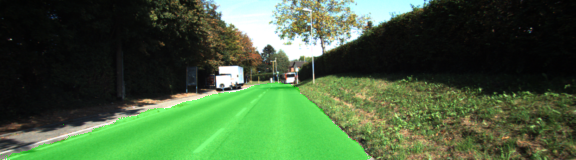
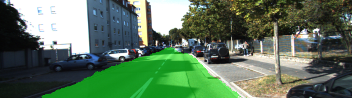
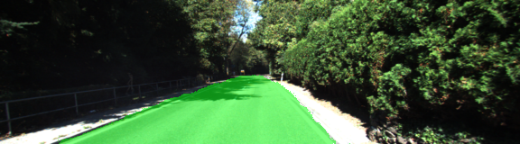
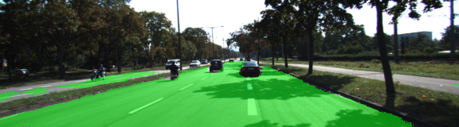
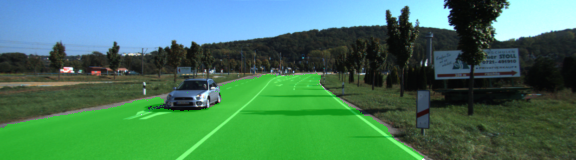
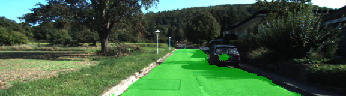
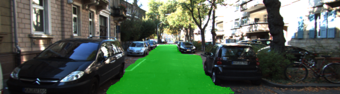

# Semantic Segmentation
### Introduction
Objective of this project is to lable non road and road pixels in image by using Fully Convolutional neural network based on VGG16

### Architecture
- Number of classes 2: road and non road
- Pretrained VGG16 network is converted into Fully Convolutional neural network by replacing fully connected layers by 1x1 convolutional layers.
- To improve performance skip connection layers are added. Layer 4 output is added to upsampled output of layer 7 and then Layer 3 output is added to upsampled output of above mentioned skip connection layer.
- Used kernel and stride values are provided in the classroom.
- Adam optimizer along with cross entropy cost function is used.

### Hyperparameters
- epochs - 100 (First used 20 but observed better results with 100 epochs)
- batch size - 4 
- learning rate - 0.0001
- keep prob - 0.7

### Results

Following are the losses after few epoches from training

| Epoch No. | loss |
| --- | --- |
| 10 | 0.34380 |
| 25 | 0.07918 |
| 50 | 0.03557 |
| 75 | 0.024471 |
| 100 | 0.02094 |

- Results of the test are in runs folder.
#### Following are few samples from result
 

 

 

 

 

 

 

